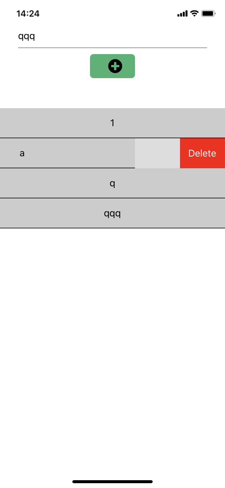
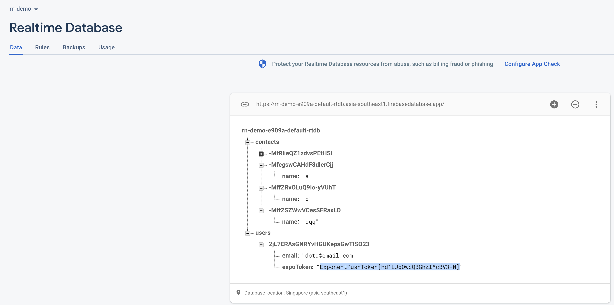
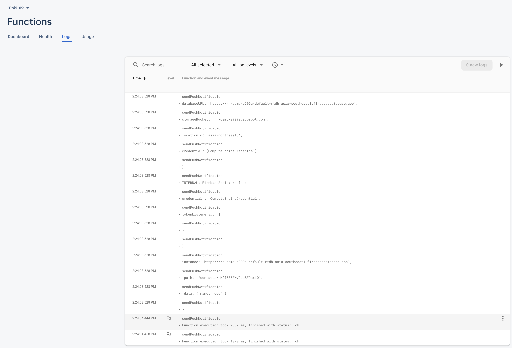
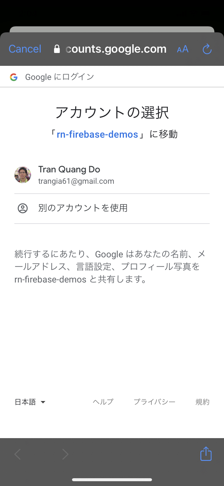
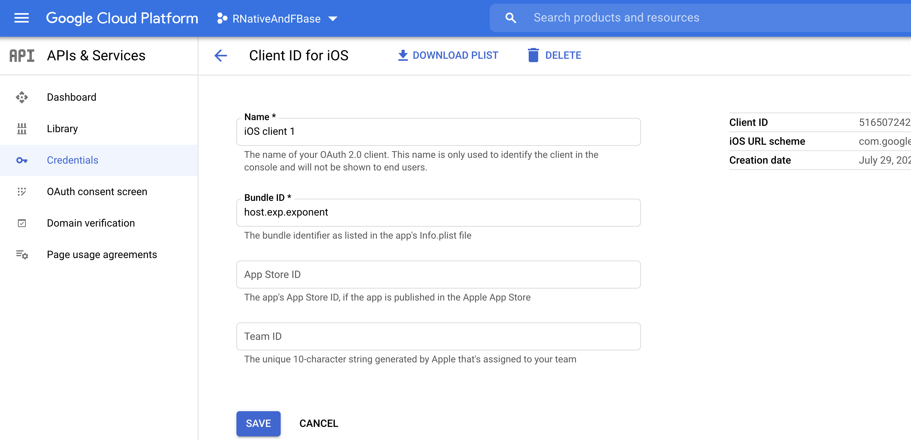
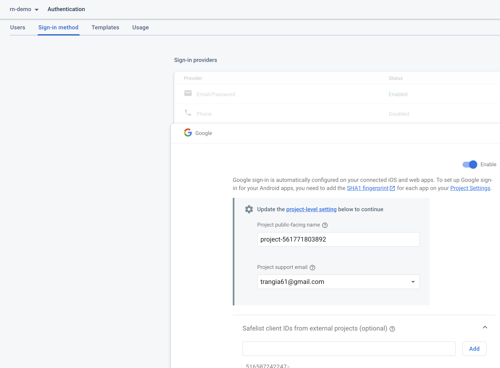

# rn-firebase-demos 🐳


[](https://github.com/tquangdo/rn-firebase-demos/issues/new)

## Usage
scan bar code on `expo go` appstore

## 1) Push notification

************************


### firebase & expo notification
1. `SwipeList&PushNoti.js`
```js
  componentDidMount() {
    try {
      this.fbase_auth.signInWithEmailAndPassword('dotq@email.com', '123456').then(
        arg_user => { this._registerForPushNotificationsAsync(arg_user) }
      )
```
- => when run expo on iphone, it will create user record (with `expoToken`) in DB:
************************


2. `functions/index.js`
```js
    return db.ref('/users').once('value').then(function (snapshot) {
```
- => add a name will push Expo notification by trigger function `sendPushNotification`
>28/7/2021 NOT show notification in iphone, still don't know why?
************************


## 2) GG login

************************

************************


### GG API
- `https://console.cloud.google.com/apis/credentials`
- `Create credentials` > `OAuth client ID`
- `Application type` > `iOS`
- `Name` > `iOS client 1`
- `Bundle ID` > `host.exp.exponent`

************************


### GG firebase
- firebase > Authentication > Sign-in method > Google: Enable > Safelist client IDs from external projects (optional)
- copy paste `OAuth client ID`

### src code
- `components/screens/LoginScreen.js: iosClientId: '<OAuth client ID>'`

************************


### install package
- `https://docs.expo.dev/versions/latest/sdk/google/`
- `expo install expo-google-app-auth`
- `components/screens/LoginScreen.js: import * as Google from 'expo-google-app-auth'`

### running result
- firebase > Authentication > Users > show gmail login acc
- firebase > Realtime Database > users > uid > record with login acc info

